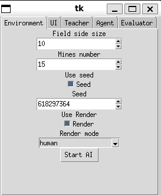
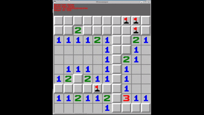

# MinesweeperAIv2

A Deep Q-Network agent that learns to play Minesweeper from scratch using Double DQN, Prioritized Experience Replay, and dense reward shaping.




## How it works

The agent observes the board as a 3-channel tensor and outputs Q-values for every possible action — either opening or flagging any cell. It never sees the hidden mine layout; it only sees what a real player would see.

**Core algorithm:**

- **Double DQN** — the online network selects the next action, the target network evaluates its value. This decouples action selection from evaluation and prevents Q-value overestimation.
- **Soft target updates** — instead of hard-copying weights periodically, the target network is blended toward the online network every step: `θ_target ← τ·θ_online + (1−τ)·θ_target` with `τ = 0.005`.
- **Prioritized Experience Replay (PER)** — transitions with high TD error are sampled more frequently. A binary SumTree gives O(log n) priority sampling. Importance-sampling weights correct for the introduced bias, with β annealed from 0.4 → 1.0 over training.
- **ε-greedy exploration** — ε decays linearly from 1.0 to 0.1 over 150 000 steps. Random actions are restricted to closed cells only, avoiding obviously invalid moves.
- **Warm-up phase** — the first 1 000 steps fill the buffer with random actions before any gradient updates begin.

**Neural network — `agent/cnn.py`:**

```
Input (B, 3, H, W)
  Conv2d(3  → 32,  3×3, pad=1) → BatchNorm2d → ReLU
  Conv2d(32 → 64,  3×3, pad=1) → BatchNorm2d → ReLU
  Conv2d(64 → 64,  3×3, pad=1) → BatchNorm2d → ReLU
  Conv2d(64 → 2,   1×1)
Output (B, 2, H, W)
```

All spatial dimensions are preserved (padding=1 throughout). Effective receptive field: **7×7 cells**. Output channel 0 = click Q-map; channel 1 = flag Q-map.

**Input encoding:** The raw `opened_field` array is converted to 3 channels before hitting the network:

| Channel | Source values | Meaning |
|---------|--------------|---------|
| 0 | `-3→-1`, `-2→0`, else as-is | Cell value (mine hit = -1, closed = 0, open 0–8) |
| 1 | `-2→0`, else 1 | Open / closed mask |
| 2 | `-1→1`, else 0 | Flag mask |

**Action space:** `Discrete(2 × H × W)`. First H×W indices are open-cell actions, next H×W are flag-toggle actions. At inference the agent masks out already-opened cells before taking the argmax.

---

## Reward function

All constants live in `minesweeper_env/game/config.py` under `RewardConfig` and can be tuned without touching game logic. `self.reward` is cumulative; `step()` returns only the delta.

| Event | Default |
|-------|---------|
| Hit a mine (game lost) | `−50.0` |
| Win (step-penalized) | `max(20.0, 100.0 − steps × 0.5)` |
| Per step taken | `−0.3` |
| Repeated click (no state change) | `−2.0` |
| Open a new safe cell | `+1.5` |
| Each already-open neighbour of opened cell | `+0.3` |
| Opened cell value × factor | `+0.8` per adjacent mine |
| 4+ neighbours open after click (surround bonus) | `+2.0` |
| Correct flag placed on a mine | `+5.0` |
| Per mine adjacent to correctly flagged cell | `+0.7` |
| Wrong flag on a safe cell | `−4.0` |
| Per newly revealed cell (bulk flood-fill) | `+0.4` |
| Net-new correctly placed flags (delta) | `+0.2` |

---

## Requirements

- Python 3.10+
- CUDA-capable GPU (recommended; CPU training works but is slow)

```bash
pip install -r requirements.txt
```

Optional:

```bash
pip install tensorboard   # for TensorBoard logging
```

---

## Usage

### Train with GUI

```bash
python main.py
# or
make train
```

Opens a Tkinter window where you configure field size, mine count, all agent hyperparameters, and training budget before starting. Training runs with a live dashboard that refreshes once per second.

### Evaluate a saved checkpoint

Load any `.pt` file from `evaluations/` through the GUI's Evaluator tab. The agent plays in a Pygame window.

### Play manually

```bash
python play_minesweeper.py
# or
make play
```

Standard Minesweeper with mouse controls: left-click to open, right-click to flag.

### Run tests

```bash
pytest test.py -v
# or
make test
```

32 unit tests covering game logic, reward calculation, and environment behaviour.

### Enable debug logging

```bash
MINESWEEPER_DEBUG=1 python main.py
# or
make debug
```

Prints per-function timing output via the `@log` decorator in `utils.py`.

---

## Project structure

```
minesweeperAIv2/
├── agent/
│   ├── cnn.py              MinesweeperAgent — fully-convolutional Q-network
│   ├── dqn.py              DQN — Double DQN, ε-greedy, PER integration, soft updates
│   ├── replaybuffer.py     ReplayBuffer (uniform) + PrioritizedReplayBuffer + SumTree
│   └── preferences.py      AgentPreferences dataclass
│
├── minesweeper_env/
│   ├── game/
│   │   ├── generator.py    Mine-field generation (deferred until first click)
│   │   ├── scanner.py      Neighbour queries, BFS flood-fill, cell value calculation
│   │   ├── minesweeper_game.py  Core game logic (no ML)
│   │   ├── renderer.py     Pygame board rendering
│   │   └── config.py       RewardConfig dataclass + global defaults
│   ├── minenv.py           MinesweeperEnv — gym.Env wrapper
│   └── preferences.py      MinesweeperGamePreferences, MinesweeperEnvPreferences
│
├── teacher/
│   ├── teacher.py          Training loop, live dashboard, evaluation, checkpointing
│   ├── evaluator.py        Load checkpoint and run demo episodes
│   ├── preferences.py      TeacherPreferences, EvaluatorPreferences
│   └── config.py           MODELS_CHECKPOINTS_PATH
│
├── menu/                   Tkinter GUI (configure and launch train / evaluate / play)
├── evaluations/            Saved .pt checkpoints and training plots
├── main.py                 Entry point: GUI → train / evaluate / play
├── play_minesweeper.py     Standalone manual Minesweeper
├── utils.py                @log decorator (optional per-function timing)
├── test.py                 pytest suite
└── Makefile                train / play / test / debug targets
```

---

## Configuration reference

| File | Dataclass | Notable defaults |
|------|-----------|-----------------|
| `minesweeper_env/preferences.py` | `MinesweeperGamePreferences` | `field_size=(10,10)`, `mines_num=15` |
| `minesweeper_env/preferences.py` | `MinesweeperEnvPreferences` | `render_mode='human'`, `env_max_steps=200` |
| `agent/preferences.py` | `AgentPreferences` | `lr=1e-4`, `gamma=0.99`, `batch_size=32`, `tau=0.005`, `epsilon_decay_steps=150000`, `warmup_steps=1000`, `buffer_size=50000` |
| `teacher/preferences.py` | `TeacherPreferences` | `eval_interval`, `learning_max_steps`, `model_filename`, `resume_from`, `use_tensorboard` |
| `minesweeper_env/game/config.py` | `RewardConfig` | all 13 reward constants (see table above) |

All of these are exposed in the GUI, so you rarely need to edit them directly.

---

## Checkpoints

A checkpoint is saved to `evaluations/` whenever a new best evaluation score is achieved (strictly greater than the previous best). The previous checkpoint is removed to save space. An additional final checkpoint is always saved at the end of training.

Filename format: `{unix_timestamp}_{steps}_{eval_score}_{model_filename}`

Checkpoint dict:

```python
{
    'network':        network.state_dict(),
    'optimizer':      optimizer.state_dict(),
    'total_steps':    int,
    'epsilon':        float,
    'top_eval_score': float,
}
```

To resume training from a checkpoint, select the file in the GUI's resume field. The agent restores `total_steps`, `epsilon`, and `top_eval_score` so that the exploration schedule and checkpoint threshold continue correctly.

---

## TensorBoard

Pass `use_tensorboard=True` via the GUI to log training metrics. Logs are written to `runs/{timestamp}/`.

```bash
tensorboard --logdir runs/
```

Tracked scalars: `train/loss`, `train/epsilon`, `eval/avg_return`, `eval/win_rate`.

---

## Training results

Training plots and a `history.csv` are saved to `evaluations/` every 10 evaluations and at the end of training. A run of 200 000 steps on a 10×10 board with 15 mines reaches an average return of ~440 in favourable seeds.

For a full breakdown of every module, encoding scheme, and the training loop see [ARCHITECTURE.md](ARCHITECTURE.md).
